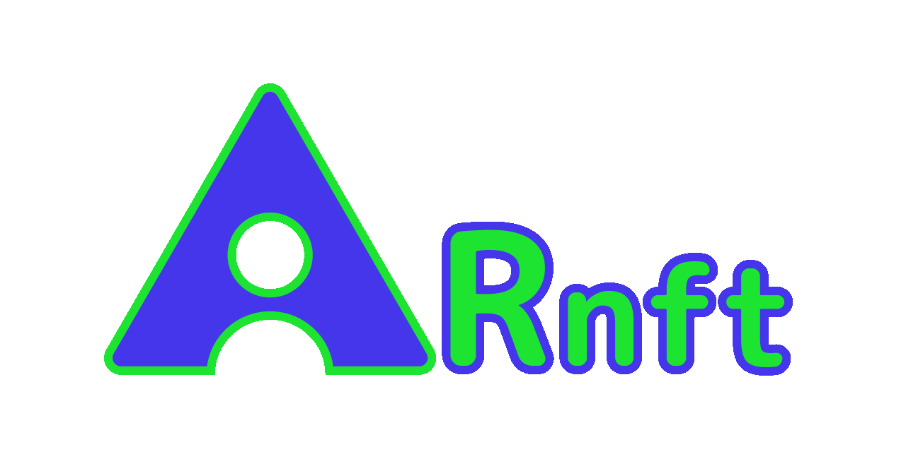

[](https://github.com/prettier/prettier)
[](https://vite.dev/)
[](https://github.com/webarkit/ARnft/actions/workflows/CI.yml)
[](https://github.com/webarkit/ARnft/actions/workflows/build.yml)


# 🖼️ ARnft - WebAR with NFT



A small javascript library to develop WebAR apps. It is based on [jsartoolkitNFT](https://github.com/webarkit/jsartoolkitNFT) a lighter version of jsartoolkit5 only with **NFT** markerless technology. It uses [ARnft-threejs](https://github.com/webarkit/ARnft-threejs) for the rendering part.

## 🚀 Start using it !

:one: &nbsp; Clone the repository:

`git clone https://github.com/webarkit/ARnft.git`

:two: &nbsp; Install the npm packages with yarn:

`yarn install`

or with npm:

`npm install`

:three: &nbsp; Run the node server:

`npx http-server -c-1`

(`-c-1` disables caching, so the browser always loads the latest `dist/` and `config.json`.)

:four: &nbsp; Go to the examples:

http://localhost:8080/examples/arNFT_example.html

To test on a phone, the page must be served over **HTTPS**, because browsers only allow the camera on HTTPS or `localhost`. Create a self-signed certificate once and start the server with it:

```bash
openssl req -x509 -newkey rsa:2048 -nodes -keyout key.pem -out cert.pem -days 365 -subj "/CN=localhost"
npx http-server -c-1 -S -C cert.pem -K key.pem
```

Then open on the phone the `https://` address printed by `http-server` for your computer, e.g. `https://192.168.1.10:8080/examples/arNFT_example.html`, and accept the certificate warning. Don't commit `cert.pem` and `key.pem`: they are listed in `.gitignore`.

:five: &nbsp; Point your device 📱 to the pinball image 👇 a red cube will appear !


## 🏎️ SIMD Feature

The ARnft library now includes support for SIMD (Single Instruction, Multiple Data) to enhance performance by parallelizing data processing tasks. This feature is particularly useful for applications requiring high computational power, such as augmented reality.

To see the SIMD feature in action, you can try the `arNFT_simd_example.html` example:

http://localhost:8080/examples/arNFT_simd_example.html

In your app, import `dist/ARnft.simd.mjs` (or `dist/ARnft.simd.js`) instead of `dist/ARnft.mjs`.

## 📦 Usage

Download the zipped dist lib package from the releases page: [webarkit/ARnft/releases](https://github.com/webarkit/ARnft/releases)
and import it as a module:

```html
<script type="importmap">
    {
        "imports": {
            "three": "./js/third_party/three.js/three.module.min.js",
            "arnft-threejs": "./js/ARnftThreejs.mjs",
            "arnft": "./../dist/ARnft.mjs"
        }
    }
</script>

<script type="module">
    import * as THREE from "three";
    import arnft from "arnft";
    const { ARnft } = arnft;
    import ARnftThreejs from "arnft-threejs";
    const { SceneRendererTJS, NFTaddTJS } = ARnftThreejs;

    // Follow code for rendering ect. see the examples.
```

or you can use raw.githack services (for development):

```html
<script type="importmap">
    {
        "imports": {
            "three": "https://cdn.jsdelivr.net/npm/three@<version>/build/three.module.min.js",
            "arnft-threejs": "https://raw.githack.com/webarkit/ARnft-threejs/master/dist/ARnftThreejs.mjs",
            "arnft": "https://raw.githack.com/webarkit/ARnft/master/dist/ARnft.mjs"
        }
    }
</script>

<script type="module">
// as the above code snippet
```

or raw.cdn (for production, you need to add the hash):

```
// As the examples above import three.js, Arnft-threejs and Arnft in an importmap
"arnft": "https://rawcdn.githack.com/webarkit/ARnft/<hash>/dist/ARnft.mjs"
```

or if you want to import as a module with npm:

```
// In your package.json:
"devDependencies": {
    "@webarkit/ar-nft": "^0.15.0"
},
```
```javascript
// Then in your .ts or .js file
import arnft from "@webarkit/ar-nft";
const { ARnft } = arnft;
```

## ⚙️ Configuration

ARnft reads its settings from the JSON file passed to `ARnft.init()` (see [examples/config.json](examples/config.json)). Unknown keys are silently ignored, so double-check the option names.

| key | meaning |
|---|---|
| `cameraPara` | URL of the camera calibration file, e.g. `examples/Data/camera_para.dat` |
| `addPath` | optional path prefix for the marker and camera files |
| `container` | `create: true` lets ARnft create the container, video and canvas; otherwise set `containerName` and `canvasName` |
| `loading` | loading screen: `create`, `logo` (`src`, `alt`) and `loadingMessage` |
| `stats` | `createHtml: true` creates the HTML elements for the stats panels |
| `oef` | smooth the marker pose with the OneEuroFilter |
| `videoSettings` | camera options, see below |

`videoSettings`:

| key | meaning |
|---|---|
| `width` | `{ min, max }` of the requested camera width |
| `height` | `{ min, max }`, kept for compatibility: the camera request currently uses only the width |
| `facingMode` | `"environment"` (back camera, the default) or `"user"` |
| `targetFrameRate` | maximum number of frames per second sent to the tracker |
| `rotatePortrait` | optional, default `false`. When the camera stream is portrait, it is rotated onto the tracking canvas instead of being letterboxed, so more of the image is used for tracking |
| `cameraLabel` | optional. Use the first camera whose name contains this text (case insensitive), e.g. `"Logitech"`. Without it, smartphones use the last listed camera and desktop browsers use the camera chosen in the browser |

## 🧪 Examples

Test the examples in the `/examples` folder:

- `arNFT_autoupdate_example.html` Example with the autoupdate routine.
- `arNFT_container_example.html` Example with an alternative container.
- `arNFT_event_example.html` Example with objVisibility and eventListener.
- `arNFT_example.html` The simplest example displaying a red cube.
- `arNFT_simd_example.html` Example with SIMD feature.
- `arNFT_gltf_brave_robot_example.html` More advanced example with a gltf model and threejs events.
- `arNFT_gltf_example.html` Example showing a gltf model (Duck).
- `arNFT_gltf_flamingo_example.html` Example showing an animated gltf model (Flamingo).
- `arNFT_image_example.html` Example showing an image.
- `arNFT_initialize_raw_example.html` Example using the custom initialize function for the CameraRenderer (video).
- `arNFT_multi_example.html` Example with multi NFT markers.
- `arNFT_multi_dispose_example.html` Example with multi NFT markers and disposing worker.
- `arNFT_multi_one_worker_example.html` Example with multi NFT markers in one Worker.
- `arNFT_video_example.html` Example showing a video.
- `arNFT_zft_example.html` Example showing a simple cube, loading a .zft file.

You can try also a live example with React at this link: [kalwalt.github.io/ARnft-ES6-react/](https://kalwalt.github.io/ARnft-ES6-react/)

## 💰 Donate
Donate to **ARnft**  

## 📚 Documentation

You can build the docs with this command:
`yarn docs`
Then run a live server and go to the docs' folder.

## 🌟 Features

- **NFT** (**N**atural **F**eature **T**racking) Markers, read my article: [NFT natural feature tracking with jsartoolkit5](https://www.kalwaltart.com/blog/2020/01/21/nft-natural-feature-tracking-with-jsartoolkit5/)
- **ZFT** compressed **NFT** markers with .zft extension, with faster loading time.
- **SIMD** (Single Instruction, Multiple Data) support for enhanced performance.
- **ES6** standard. You can install it as a npm package and use it as a module (experimental). Install it with npm:

```
npm i @webarkit/ar-nft
```

or with yarn:

```
yarn add @webarkit/ar-nft
```

- Configuration data in an external .json file.

- Filtering of the matrix with the **O**ne**E**uro**F**ilter.

- Rotating the phone between portrait and landscape keeps the content aligned on the marker; portrait streams can also be rotated onto the tracking canvas (`rotatePortrait`).

- Choosing the camera by name (`cameraLabel`).

## 🛠️ Format the code with Prettier
We are using [Prettier](https://prettier.io/) as code formatter. You only need to run `yarn format` to write the formatted code with Prettier. If you want to check if the code is well formatted run instead: `yarn format-check`

## 🔧 Build
The library is built with [Vite](https://vite.dev/). If you make changes to the code, install all the dependencies with:
```
yarn install
```
To rebuild `dist/` and `types/` (standard and SIMD bundles) on every change, run:
```
yarn dev-ts
```
For a clean build, to run before committing `dist/` and `types/`:
```
yarn build-ts
```
Both produce the same minified bundles. See [CONTRIBUTING.md](CONTRIBUTING.md) (and [AGENTS.md](AGENTS.md) if you work with an AI coding agent) for the contribution workflow.